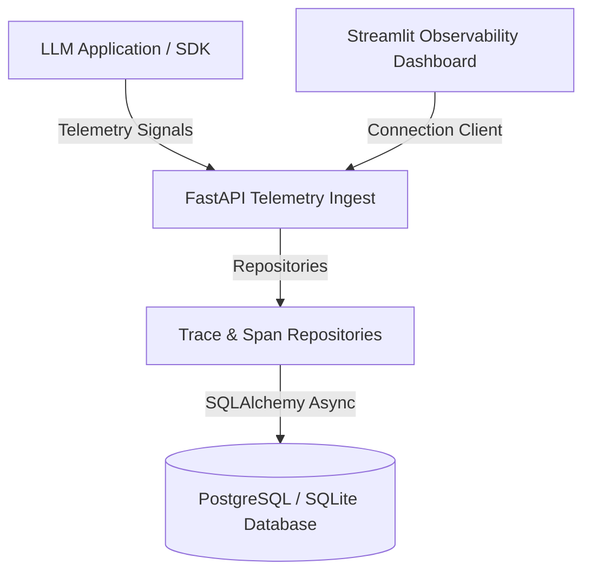

# Enterprise LLM Observability Platform

[](https://www.python.org/)
[](https://fastapi.tiangolo.com/)
[](https://www.docker.com/)
[](https://www.postgresql.org/)
[](LICENSE)

An enterprise-grade, open-source LLM Observability & Cost-Performance Platform designed for high-throughput model inference tracing, token cost analytics, quality evaluations, and performance monitoring.

---

## 🎨 Observability Console Preview

Our premium dark-themed Streamlit dashboard provides deep, context-aware operational insights:
- **System Health Overview**: Live charts tracking request volumes, throughput timeseries, success rates, and token expenditures.
- **Trace Explorer Gantt Charts**: Granular timelines displaying call hierarchies and duration offsets for nested LLM, database, or tool steps.
- **Model Comparison Matrix**: Comparative dashboards comparing cost efficiencies and latency histograms across providers.
- **Scorers Evaluations Auditor**: Factual groundedness, faithfulness, hallucination metrics, and semantic similarity audits.
- **Threshold Alerts Rule Engine**: Active warnings flagging latency regressions and transaction cost limit crossings.

---

## 🌟 Feature Comparison Matrix

| Capability | LangSmith / Langfuse | This Observability Platform |
| :--- | :--- | :--- |
| **Telemetry SDK** | Async wrappers | Thread-safe, ContextVar-driven context managers |
| **Cost Calculator** | Standard static rates | Pre-token dynamic cost calculator linking price tables |
| **Evaluation Engine** | API assertions | Decoupled dynamic Scorer Factory with 5 quality metric scorers |
| **Operational Alerts** | Simple metrics thresholds | Advanced rule alerts checking latency regressions |
| **Local Playground** | Staging endpoints | Connection diagnostics and interactive inference query tester |

---

## 🏗️ System Component Topology



*For more details on sequence flows and entity structures, check out our [Architecture Guide](docs/architecture.md).*

---

## 📂 Repository Structure

```
.github/               # CI/CD Workflows
backend/
    app/
        api/           # API endpoint routers (/inference, /traces, /alerts)
        core/          # Configuration Settings schema & structlog definitions
        db/            # Connection pooling async session setups
        evaluation/    # Dynamic Scorer Factory & concrete evaluations logic
        models/        # Declarative SQLAlchemy 2.0 ORM model entities
        providers/     # normalized provider connectors (OpenAI, Ollama)
        repositories/  # Isolated database CRUD operations (Repository Pattern)
        sdk/           # Telemetry tracing Context Managers
        services/      # Analytics, Telemetry, and Evaluation orchestration
    Dockerfile
    seed.py            # Database synthetic data seeder
dashboard/
    assets/            # Premium dark glassmorphism styling stylesheet overrides
    components/        # Navbar, stateful sidebar, charts, tables
    pages/             # Overview, Traces, Analytics, Evaluations, Alerts, Settings
    services/          # API connection clients
tests/                 # Async test suites validating SDK, API, and Scorers
docs/                  # Professional markdown document guides
    architecture.md    # Mermaid pipeline, sequence, and ER diagrams
    api.md             # Ingest payloads and endpoints specifications
    setup.md           # Environment variables list and install guide
docker-compose.yml     # PostgreSQL and API container configurations
LICENSE                # MIT License
pyproject.toml         # Ruff, MyPy, and pytest parameters definitions
```

---

## 🚀 Quick Start & Installation

### 🐳 Run Containerized Stack (Recommended)
Stand up the database and FastAPI server instantly using Docker Compose:
```bash
docker-compose up --build
```
Verify backend connection status at: `http://localhost:8000/health`.

### 💻 Local Manual Setup
1. **Initialize and Activate Virtual Environment**:
   ```bash
   python -m venv venv
   source venv/bin/activate  # On Windows: .\venv\Scripts\activate
   ```
2. **Install Dependencies**:
   ```bash
   pip install -r backend/requirements.txt
   ```
3. **Copy Configuration Settings**:
   ```bash
   cp .env.example .env
   ```
4. **Upgrade Database & Run Alembic Migrations**:
   ```bash
   cd backend
   alembic upgrade head
   cd ..
   ```
5. **Start Ingest Server**:
   ```bash
   uvicorn backend.app.main:app --reload --port 8000
   ```
6. **Launch Observability Dashboard**:
   ```bash
   streamlit run dashboard/app.py
   ```

*For more details on configuration parameters, refer to our [Setup Guide](docs/setup.md).*

---

## 🛡️ License

This project is licensed under the terms of the MIT License. See [LICENSE](LICENSE) for details.
