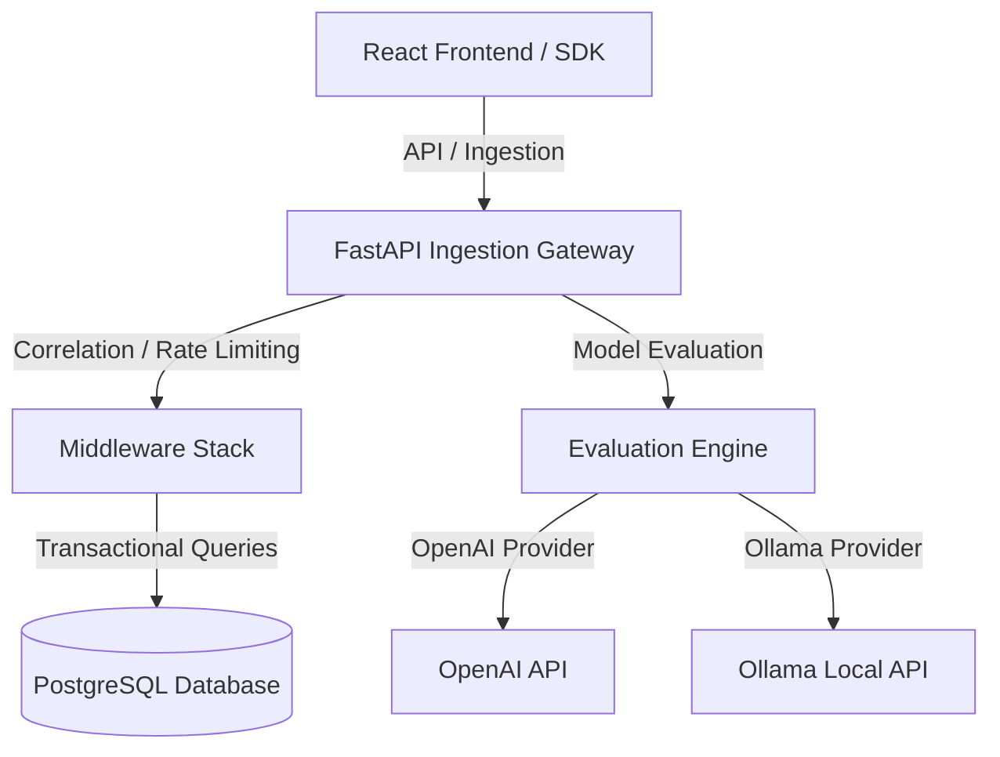

# LLM Command Center

LLM Command Center is a production-grade observability platform designed to monitor, trace, evaluate, and analyze large language model workloads.

<p align="center">
  
</p>

---

## Technical Architecture



### Request Lifecycle
1. **Ingest Phase:** Telemetry SDK captures model inputs, prompt variables, and metadata parameters, submitting them to `/api/v1/traces`.
2. **Middleware Phase:** Requests pass through the `CorrelationMiddleware` (adds transaction IDs) and `RateLimiterMiddleware` (guards against request spikes).
3. **Database Phase:** Records are written transactionally to PostgreSQL tables.
4. **Scoring Phase:** The `EvaluationEngine` triggers async similarity/groundedness calculations using configured providers.

---

## Directory Structure

```text
LLMProject/
├── backend/                  # FastAPI Application Root
│   ├── app/                  # Application Package
│   │   ├── api/              # API Route Handlers
│   │   ├── core/             # Configuration, Middlewares, Rate Limiter
│   │   ├── db/               # SQLAlchemy Session and Engine Factory
│   │   ├── models/           # SQLAlchemy DB Models
│   │   ├── repositories/     # Data Persistence Layers
│   │   ├── schemas/          # Pydantic Schemas
│   │   ├── services/         # Business Logic Layer
│   │   ├── providers/        # LLM Connectors (OpenAI, Ollama)
│   │   ├── evaluation/       # Quality Assessment Engines
│   │   ├── sdk/              # Telemetry Capture SDK
│   │   ├── utils/            # Shared Utilities
│   │   └── main.py           # FastAPI Main Entrypoint
│   ├── alembic/              # DB Schema Versions
│   ├── tests/                # Automated Pytest Suite
│   ├── requirements.txt      # Dependency Definitions
│   ├── Dockerfile            # Container Definition
│   ├── alembic.ini           # Alembic Configuration
│   └── .env.example          # Environment Template
├── frontend/                 # React Application Root
│   ├── src/                  # React Source Code
│   ├── public/               # Static Web Assets
│   ├── package.json          # Node Configurations
│   ├── vite.config.js        # Vite Build Settings
│   └── .env.example          # Frontend Environment Template
├── docs/                     # Technical Documentation
├── docker-compose.yml        # Multi-Container Deployment Orchestrator
├── render.yaml               # Render Infrastructure Blueprint
└── LICENSE                   # Project License
```

---

## Database Schema

```sql
CREATE TABLE users (
    id UUID PRIMARY KEY DEFAULT gen_random_uuid(),
    email VARCHAR(255) UNIQUE NOT NULL,
    name VARCHAR(255) NOT NULL,
    hashed_password VARCHAR(255) NOT NULL,
    is_active BOOLEAN DEFAULT TRUE,
    created_at TIMESTAMP WITH TIME ZONE DEFAULT NOW()
);

CREATE TABLE password_reset_tokens (
    id UUID PRIMARY KEY DEFAULT gen_random_uuid(),
    user_id UUID REFERENCES users(id) ON DELETE CASCADE,
    otp VARCHAR(255) NOT NULL,
    expires_at TIMESTAMP WITH TIME ZONE NOT NULL,
    used BOOLEAN DEFAULT FALSE,
    created_at TIMESTAMP WITH TIME ZONE DEFAULT NOW()
);
```

---

## Authentication & Security

### Authentication Flow
1. **User Registration:** `POST /api/v1/auth/register` creates a new user, hashes the password with `bcrypt`, and commits to the database.
2. **User Login:** `POST /api/v1/auth/login` checks the user credentials against the database, verifies the password using `bcrypt`, and returns a JWT access token.
3. **Protected Endpoints:** `GET /api/v1/auth/me` and other protected endpoints require an `Authorization: Bearer <token>` header, verified against the database session.

### JWT Flow
* **Algorithm:** HS256
* **Expiration:** 24 Hours
* **Payload Structure:**
  ```json
  {
    "sub": "user@company.com",
    "email": "user@company.com",
    "iat": 1692234000,
    "exp": 1692320400
  }
  ```

### Password Reset Flow (OTP)
1. **Request Reset:** `POST /api/v1/auth/forgot-password` generates a 6-digit OTP, deletes previous unused OTPs, stores the new OTP (expires in 15 minutes), and sends an email via **SendGrid**.
2. **Verify & Update:** `POST /api/v1/auth/reset-password` validates the OTP and its expiration, updates the user's password with a new `bcrypt` hash, marks the OTP as used, and cleans up expired OTPs from the database.

---

## API Reference Overview

| Method | Route | Authorization | Description |
| :--- | :--- | :--- | :--- |
| `POST` | `/api/v1/auth/register` | Public | Registers a new user with email, name, password |
| `POST` | `/api/v1/auth/login` | Public | Validates credentials and yields JWT access token |
| `POST` | `/api/v1/auth/forgot-password` | Public | Generates a 6-digit password reset OTP and emails it |
| `POST` | `/api/v1/auth/reset-password` | Public | Validates OTP and updates password |
| `GET` | `/api/v1/auth/me` | Protected | Returns profile details of current authenticated user |
| `POST` | `/api/v1/traces` | Public | Ingests telemetry logs from LLM executions |
| `GET` | `/api/v1/traces` | Protected | Queries historical execution logs (paginated) |
| `GET` | `/api/v1/analytics/kpis` | Protected | Returns core metrics (latency, tokens, cost aggregates) |
| `GET` | `/health` | Public | Core platform health check |

---

## Deployment Instructions

### Render Deployment (Backend)
1. Register a new web service on Render pointing to your fork.
2. Select Root Directory: `backend`.
3. Set the build command to `pip install -r requirements.txt` and the start command to `uvicorn app.main:app --host 0.0.0.0 --port $PORT`.
4. Add all environment variables defined in `backend/.env.example`.

### Vercel Deployment (Frontend)
1. Add a new project on Vercel pointing to the `frontend` root directory.
2. Configure settings: Framework Preset `Vite`, Build Command `npm run build`, Output Directory `dist`.
3. Add `vercel.json` rewrite proxy rules for API routes to target your Render backend endpoint.

---

## Local Development Guide

### Prerequisites
* Python 3.11+
* Node.js 18+
* PostgreSQL 15+

### Backend Setup
1. Create a Python virtual environment:
   ```bash
   cd backend
   python -m venv venv
   source venv/bin/activate
   pip install -r requirements.txt
   ```
2. Initialize and migrate the database:
   ```bash
   python -m alembic upgrade head
   python seed.py
   ```
3. Run the development server:
   ```bash
   uvicorn app.main:app --reload
   ```

### Frontend Setup
1. Install dependencies and start the development server:
   ```bash
   cd frontend
   npm install
   npm run dev
   ```

---

## License
Distributed under the MIT License. See `LICENSE` for details.
