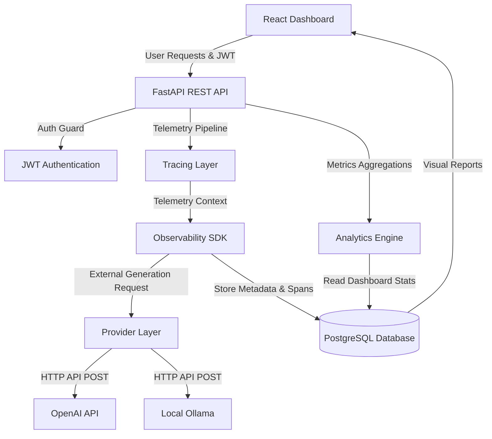
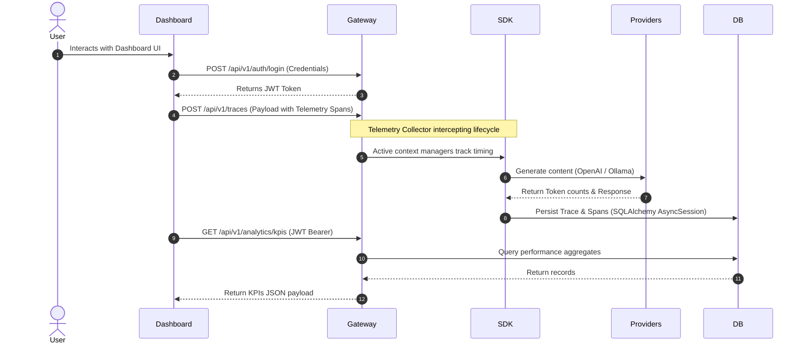

<p align="center">
  <h1 align="center">LLM Observability & Cost-Performance Pipeline</h1>
  <p align="center">Production-ready observability platform for monitoring LLM applications through latency analysis, token usage tracking, execution tracing, cost analytics, and interactive performance dashboards.</p>
</p>

<p align="center">
  <a href="https://llm-observability-pipeline-ten.vercel.app">
    
  </a>
  <a href="https://llm-observability-pipeline.onrender.com/docs">
    
  </a>
  <a href="https://github.com/Sakshisrivastava01/llm-observability-pipeline">
    
  </a>
</p>

<p align="center">
  
  
  
  
  
  
  
  
  
  
  
</p>

---

## Project Overview

LLM Observability & Cost-Performance Pipeline instruments large language model inference requests across multiple providers, supporting both cloud-based OpenAI REST endpoints and local Ollama deployments. By integrating custom context-bound SDK modules, the system automatically captures execution latency, tracks input/output token counts, and estimates runtime transaction pricing without adding query latency. Collected data is persisted to a PostgreSQL database via SQLAlchemy async sessions, enabling developers to monitor performance trends, debug trace spans, and evaluate consistency metrics. It provides an intuitive, React-based dashboard for side-by-side model cost-performance comparisons and securely handles authentication via JWT access controls.

---

## Features

| Feature | Details |
| :--- | :--- |
| **Multi-Provider LLM Support** | Direct execution routing to OpenAI REST endpoints and local Ollama integrations. |
| **Request Tracing** | Hierarchical trace and span context capturing using Python's `contextvars`. |
| **Token Usage Analytics** | Live tracking of prompt and completion token counts per execution request. |
| **Cost Monitoring** | Instant cost estimation mapping input and output tokens to pricing models. |
| **Latency Monitoring** | Granular timing checks logging span-level and overall request processing times. |
| **Performance Dashboard** | Responsive React application mapping KPIs, latency distributions, and throughput trends. |
| **JWT Authentication** | Secure user registration, credential hashing with bcrypt, and session authorization. |
| **REST APIs** | Standardized FastAPI endpoints validated via strict Pydantic schemas. |
| **Historical Metrics** | Database queries isolating percentile trends (P50, P90, P95, P99) and errors. |
| **Interactive Charts** | Visual data plotting using Recharts for dynamic multi-model metrics comparisons. |
| **Secure User Management** | Protected user profiles, access controls, and validation token OTP password resets. |

---

## System Architecture



---

## Data Flow Diagram



---

## Tech Stack

### Frontend
<p align="left">
  
  
  
  
  
  
</p>

### Backend
<p align="left">
  
  
  
  
  
  
</p>

### LLM Integrations
<p align="left">
  
  
</p>

### Database
<p align="left">
  
  
</p>

### Deployment & Version Control
<p align="left">
  
  
  
  
  
</p>

---

## Project Structure

```text
llm-observability-pipeline/
├── backend/            # Python FastAPI backend application gateway
├── frontend/           # React dashboard UI compiled with Vite
├── docs/               # Technical deployment and API documentation
└── tests/              # Automated unit and integration test suite
```

---

## API Overview

| Method | Endpoint | Purpose | Authorization |
| :--- | :--- | :--- | :--- |
| `POST` | `/api/v1/auth/register` | User profile initialization | Public |
| `POST` | `/api/v1/auth/login` | Credentials authentication and token yield | Public |
| `GET` | `/api/v1/auth/me` | Active profile details resolution | Yes (JWT) |
| `POST` | `/api/v1/traces` | Telemetry log execution block ingestion | Public |
| `GET` | `/api/v1/traces` | Query historical execution data | Yes (JWT) |
| `GET` | `/api/v1/analytics/kpis` | Aggregated cost and latency stats | Yes (JWT) |
| `GET` | `/api/v1/alerts` | Query active performance anomalies | Yes (JWT) |

---

## Getting Started

### 1. Clone & Environment
```bash
git clone https://github.com/Sakshisrivastava01/llm-observability-pipeline.git
cd llm-observability-pipeline
```

### 2. Backend Setup
```bash
cd backend
python -m venv venv
source venv/bin/activate  # Windows: venv\Scripts\activate
pip install -r requirements.txt
python -m alembic upgrade head
python seed.py
uvicorn app.main:app --reload --port 8000
```

### 3. Frontend Setup
```bash
cd ../frontend
npm install
npm run dev
```

### 4. Docker Compose
```bash
docker-compose up --build
```

---

## Future Roadmap

- [ ] Support additional LLM providers (Anthropic Claude, Cohere)
- [ ] Real-time WebSocket connection for live telemetry feeds
- [ ] Distributed tracing supporting multiple microservice environments
- [ ] Role-based access control (RBAC) improvement schemes
- [ ] Automated dashboard analytics PDF/CSV report exports
- [ ] Automated performance degradation alert dispatch channels

---

### License
Distributed under the MIT License. See [LICENSE](file:///c:/Users/saksh/OneDrive/Desktop/LLMProject/LICENSE) for more details.

### Author
Designed and developed by [Sakshi Srivastava](https://www.linkedin.com/in/sakshi-srivastava-/).

### Contributing
Contributions are welcome. Please check git issues or open a pull request.
