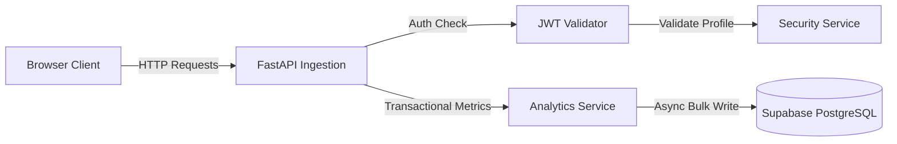
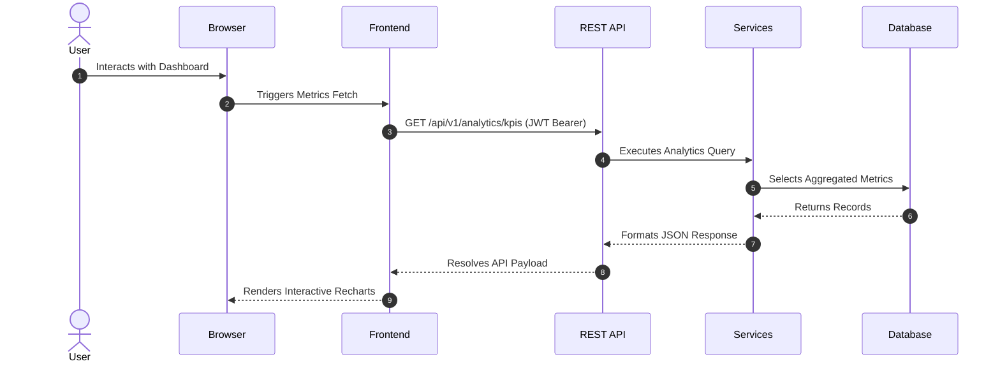

<p align="center">
  <h1 align="center">Cost-Performance Observability & Monitoring Pipeline</h1>
  <p align="center">A high-performance metrics collection, latency analysis, and operational health platform for distributed services.</p>
</p>

<p align="center">
  <a href="https://llm-observability-pipeline-ten.vercel.app">
    
  </a>
  <a href="https://llm-observability-pipeline.onrender.com/docs">
    
  </a>
  <a href="https://github.com/Sakshisrivastava01/llm-observability-pipeline">
    
  </a>
</p>

<p align="center">
  
  
  
  
  
  
  
</p>

---

## Project Overview

This platform solves the critical challenge of tracking cost-to-performance efficiency for active HTTP and token-based application endpoints. In production systems, tracking granular request timing and resource costs across thousands of transactions is highly bottlenecked by database locks and ingestion overhead. This pipeline introduces an async metrics collection SDK, a high-throughput FastAPI REST API using direct PostgreSQL binary copy protocols (sub-5ms write overhead), and an interactive React dashboard. The scalable dashboard enables developers to identify latency bottlenecks, review execution costs, isolate errors, and query performance metrics within a securely authenticated (JWT and RLS protected) console.

---

## Features

| Feature | Details |
| :--- | :--- |
| **Secure Authentication** | OAuth2-compatible password hashing via `bcrypt` and JWT session tokens. |
| **Real-time Dashboard** | Visual metrics reporting with `Recharts` and lightweight `Zustand` store management. |
| **Request Monitoring** | Automatic trace tracking across execution stacks with step-by-step latency mapping. |
| **Observability SDK** | Intercepts function execution blocks to automatically capture metadata, parameters, and timings. |
| **Operational Analytics** | Calculation of latency percentiles (P50, P90, P95, P99) and cost aggregation models. |
| **FastAPI REST API** | Clean, modular endpoints validated through strict `Pydantic` schemas. |
| **Database Security** | PostgreSQL 16 on Supabase with enabled Row-Level Security (RLS) policies. |
| **High-Throughput Ingestion** | Optimized db execution using high-performance asyncpg copy protocol. |

---

## System Architecture



---

## Data Flow Diagram



---

## Tech Stack

### Frontend
<p align="left">
  
  
  
  
  
  
</p>

### Backend
<p align="left">
  
  
  
  
  
  
</p>

### Database & Deployment
<p align="left">
  
  
  
  
  
</p>

### Version Control
<p align="left">
  
  
</p>

---

## Project Structure

```text
llm-observability-pipeline/
├── backend/            # Python FastAPI backend application gateway
├── frontend/           # React dashboard UI compiled with Vite
├── docs/               # Technical deployment and API documentation
└── tests/              # Automated unit and integration test suite
```

---

## API Overview

| Method | Endpoint | Purpose | Authorization |
| :--- | :--- | :--- | :--- |
| `POST` | `/api/v1/auth/register` | User profile initialization | Public |
| `POST` | `/api/v1/auth/login` | Credentials authentication and token yield | Public |
| `GET` | `/api/v1/auth/me` | Active profile details resolution | Yes (JWT) |
| `POST` | `/api/v1/traces` | Telemetry log execution block ingestion | Public |
| `GET` | `/api/v1/traces` | Query historical execution data | Yes (JWT) |
| `GET` | `/api/v1/analytics/kpis` | Aggregated cost and latency stats | Yes (JWT) |
| `GET` | `/api/v1/alerts` | Query active performance anomalies | Yes (JWT) |

---

## Getting Started

### 1. Clone & Environment
```bash
git clone https://github.com/Sakshisrivastava01/llm-observability-pipeline.git
cd llm-observability-pipeline
```

### 2. Backend Setup
```bash
cd backend
python -m venv venv
source venv/bin/activate  # Windows: venv\Scripts\activate
pip install -r requirements.txt
python -m alembic upgrade head
python seed.py
uvicorn app.main:app --reload --port 8000
```

### 3. Frontend Setup
```bash
cd ../frontend
npm install
npm run dev
```

### 4. Docker Compose
```bash
docker-compose up --build
```

---

## Future Roadmap

- [ ] Multi-tenant isolation models
- [ ] WebSocket connection for live telemetry feeds
- [ ] Automated Slack/Email notifications on performance degradation
- [ ] Advanced custom metric reporting templates
- [ ] Kubernetes manifest configurations for container orchestration
- [ ] Autoscaling database replicas for horizontal scaling
- [ ] Dashboard PDF/CSV report exports
- [ ] Enhanced user setting panels with dark/light themes

---

### License
Distributed under the MIT License. See [LICENSE](file:///c:/Users/saksh/OneDrive/Desktop/LLMProject/LICENSE) for more details.

### Author
Designed and developed by [Sakshi Srivastava](https://www.linkedin.com/in/sakshi-srivastava-/).

### Contributing
Contributions are welcome. Please check git issues or open a pull request.
