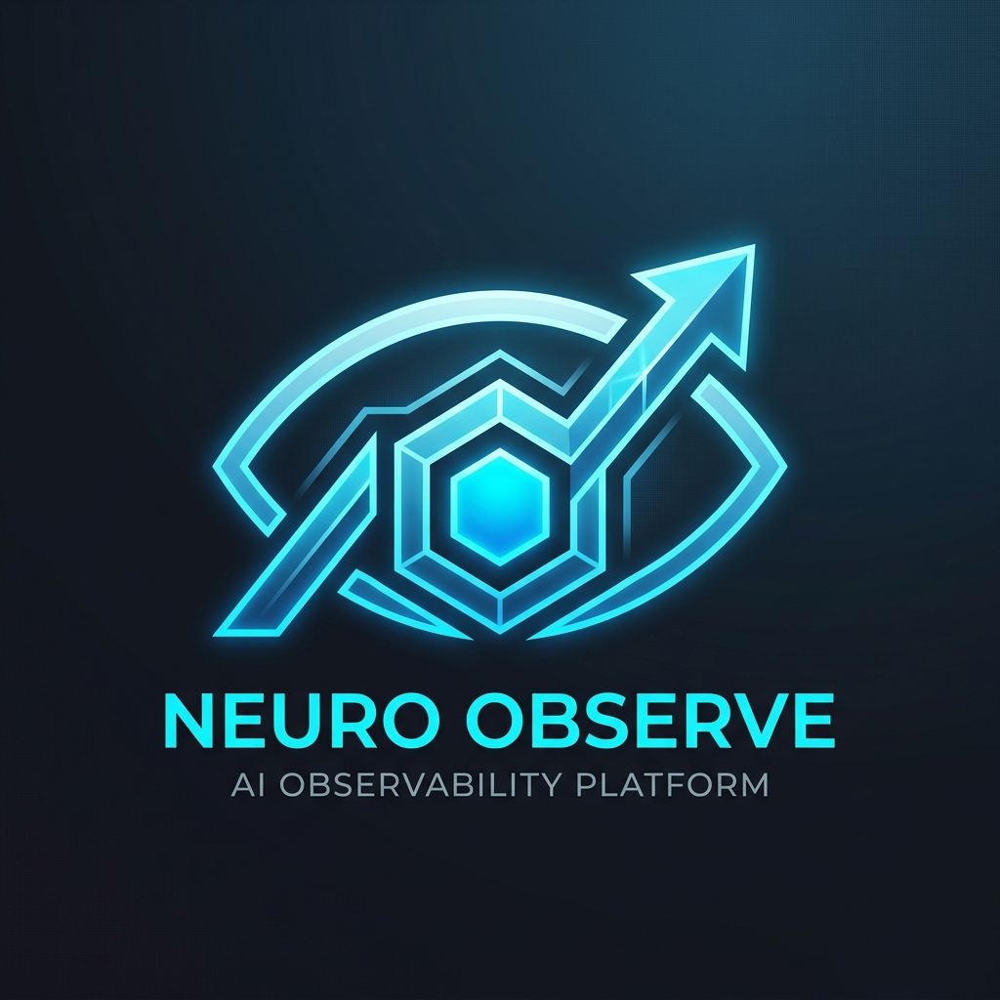
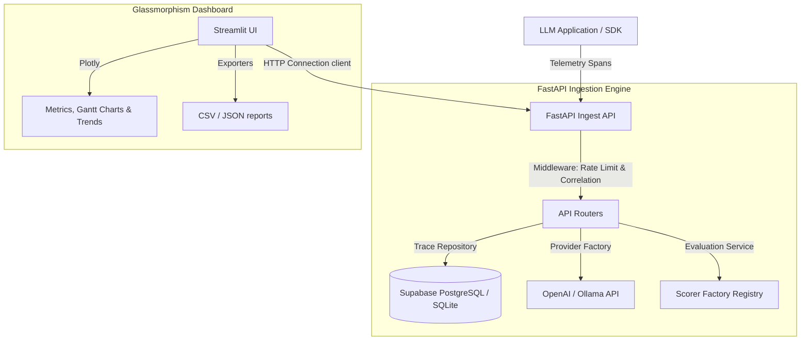

# Enterprise LLM Observability Platform

An enterprise-grade, open-source LLM Observability & Cost-Performance Platform designed for high-throughput model inference tracing, token cost analytics, quality evaluations, and performance monitoring.



[](https://www.python.org/)
[](https://fastapi.tiangolo.com/)
[](https://www.postgresql.org/)
[](https://github.com/astral-sh/ruff)
[](http://mypy-lang.org/)
[](LICENSE)

---

## Tech Stack

### Backend
* **Python**: version `3.11`
* **FastAPI**: Asynchronous REST API routing engine
* **SQLAlchemy**: version `2.0` (Async engine session pooling)
* **Alembic**: Database migrations management schema
* **Pydantic**: version `v2` (Request validation & settings configurations)
* **structlog**: Thread-local context-bound structured JSON logging
* **httpx**: Async HTTP connection client pool

### AI / LLM
* **OpenAI SDK**: Inference completions routing
* **Ollama**: Local inferences completions connector

### Dashboard
* **Streamlit**: Glassmorphic dark SaaS UI panel
* **Plotly Express**: Dynamic interactive visualizations charts
* **Pandas**: Analytics grid data manipulation

### DevOps
* **Docker / Docker Compose**: Multi-container service orchestrations
* **GitHub Actions**: Continuous integration caching builds pipeline

### Quality
* **Ruff**: Format compliance checks & import sorting
* **MyPy**: Strict static typing assertions
* **Pytest**: Async integration tests suite

### Database
* **PostgreSQL**: Production relational engine
* **AsyncPG**: Asynchronous PostgreSQL adapter driver
* **aiosqlite**: Asynchronous SQLite driver for testing/offline execution

### Architecture
* **Repository Pattern**: Isolated transaction queries layer
* **Service Layer Pattern**: Business rule transaction orchestrations
* **Dependency Injection**: Injected database sessions and context objects
* **Provider Factory**: Modular LLM completions connector registry
* **Async Programming**: Explicit `async`/`await` event loop non-blocking stack
* **SOLID Principles**: Clean interface segregation and single responsibility separation

---

## Features

* **Telemetry Collection**: Intercepts LLM inference pipelines, logging trace start times, parent/child spans hierarchies, tokens count, and pricing costs.
* **Trace Explorer**: Stateful timeline tables with visual nested Gantt chart latency maps.
* **Evaluation Engine**: Registry to trigger real-time LLM-in-the-loop scoring.
  * **Hallucination Detection**: LLM audits validating if output asserts undocumented claims.
  * **Groundedness Evaluation**: Asserts that generations are derived strictly from reference context.
  * **Faithfulness Evaluation**: Inspects consistency of outputs against user input prompts.
  * **Semantic Similarity**: Calculates Jaccard word-overlap coefficient between outputs and targets.
* **Analytics Engine**:
  * **Regression Detection**: Warning checks comparing P95 latencies against baselines.
  * **Alert Engine**: Severity limits (warning/critical) tracking latency thresholds and token cost bounds, with active status acknowledgements.
  * **Provider Comparison**: Compares avg speeds, costs, failure rates, and requests volume across OpenAI and Ollama.
  * **Cost & Latency Analytics**: Charts tracking token budgets and latency averages.
* **Modern Dashboard**: Glassmorphic dark theme dashboard featuring auto-refresh timers, connection indicators, and data export.
* **Docker Support**: Containerized PostgreSQL database and API ingest deployments.
* **CI/CD**: Auto format, lint checks, type alignments, and integration tests execution on push/PR.

---

## Architecture



---

## Project Structure

```
.github/workflows/       # GitHub Actions CI pipeline configs
backend/
    alembic/             # Alembic database migrations history
    app/
        api/v1/          # FastAPI routers (endpoints definitions)
        core/            # Settings config, middleware, rate limiter, circuit breakers
        db/              # Async session pooling setup
        models/          # SQLAlchemy ORM models definitions
        providers/       # LLM provider abstractions (OpenAI, Ollama)
        repositories/    # Repository database transaction layer
        sdk/             # ContextVar telemetry tracing context manager
        services/        # Business logic services (analytics, telemetry, evaluation)
        main.py          # FastAPI application entrypoint
    Dockerfile           # API container build definition
    requirements.txt     # Backend python dependencies
    seed.py              # Synthetic telemetry database seeder
dashboard/
    assets/              # CSS style overrides sheet
    components/          # Sidebar, navbar, charts, trace grids
    pages/               # Overview, Traces, Analytics, Evaluations, Alerts, Settings
    services/            # API connector client
    Dockerfile           # Streamlit container build definition
    requirements.txt     # Dashboard python dependencies
docs/
    api.md               # API endpoints specifications
    architecture.md      # Database and component topologies
    deployment.md        # Supabase, Render, and Streamlit Cloud guides
    setup.md             # Local environment configurations settings
tests/                   # Pytest integration tests suites
docker-compose.yml       # Platform multi-container launch compose
pyproject.toml           # Ruff, MyPy, and pytest configs
README.md                # Platform presentation page
LICENSE                  # MIT License text
```

---

## Dashboard Preview

*Below are UI visualizations mapped to each of the 7 observability console pages:*

| Tab / View | Interface Description | Visual Preview |
|---|---|---|
| **Overview Dashboard** | Real-time requests count, avg latencies, cumulative costs, token usage, success rates, and throughput curves. |  |
| **Trace Explorer** | List of traces, filter controls, inputs/outputs json, and Gantt latency waterfalls. | *(Preview Placeholder - doc/screenshots/traces.png)* |
| **Analytics Console** | P50/P90/P95/P99 percentiles, anomaly warnings, and linear predictive trends. | *(Preview Placeholder - doc/screenshots/analytics.png)* |
| **Evaluation Center** | Quality score history lines, manual scorer run form, and evaluations list. | *(Preview Placeholder - doc/screenshots/evals.png)* |
| **Alert Center** | active severity alarms, descriptions, and acknowledge warnings buttons. | *(Preview Placeholder - doc/screenshots/alerts.png)* |
| **Model Comparison** | Side-by-side stats comparing speed, costs, failure rates, and volumes of OpenAI vs Ollama. | *(Preview Placeholder - doc/screenshots/comparison.png)* |
| **Settings Console** | connection health diagnostics, pricing rate setups, and playground query testers. | *(Preview Placeholder - doc/screenshots/settings.png)* |

---

## API Reference

*Detailed specifications are available in the [API Documentation](docs/api.md).*

### Telemetry & Ingestion
* `POST /api/v1/traces`: Ingest telemetry logs directly from client SDK.
* `GET /api/v1/traces`: Retrieve paginated list of traces.
* `GET /api/v1/traces/{trace_id}`: Retrieve detailed trace details and child spans.

### LLM completions Proxy
* `POST /api/v1/inference`: Run inference, calculate pricing, and trigger auto-evaluations.

### Analytics & Diagnostics
* `GET /api/v1/analytics/kpis`: Query system-wide request volume, cost, and tokens counts.
* `GET /api/v1/analytics/models`: Query trace count distribution per LLM model name.
* `GET /api/v1/analytics/regressions`: Check for active duration latency regressions warnings.
* `GET /api/v1/analytics/advanced`: Query advanced P50/P90/P95/P99, anomaly logs, and trend forecasts.
* `GET /api/v1/analytics/summaries`: Query throughput trends and rolling average data.
* `GET /api/v1/analytics/providers`: Compare and rank OpenAI vs Ollama metrics.

### Evaluations & Pricing
* `POST /api/v1/evaluations/run`: Trigger manual evaluation scorer.
* `GET /api/v1/evaluations`: Query evaluations logging records.
* `POST /api/v1/pricing`: Register or update model pricing token rates.
* `GET /api/v1/pricing`: Retrieve active model token pricing setups.

### Exporters & Health
* `GET /api/v1/traces/export`: Export trace logs to CSV or JSON formats.
* `GET /api/v1/evaluations/export`: Export evaluations logs to CSV or JSON formats.
* `GET /api/v1/health`: Ingest API health check status.
* `GET /api/v1/health/diagnostics`: Deep database, OpenAI, and Ollama connection checks.

---

## Installation & Setup

### Local Manual Installation
1. **Initialize and Activate Virtual Environment**:
   ```bash
   python -m venv venv
   source venv/bin/activate  # On Windows: .\venv\Scripts\activate
   ```
2. **Install Dependencies**:
   ```bash
   pip install -r backend/requirements.txt
   pip install -r dashboard/requirements.txt
   ```
3. **Copy Configuration Settings**:
   ```bash
   cp .env.example .env
   ```
4. **Upgrade Database & Run Alembic Migrations**:
   ```bash
   cd backend
   alembic upgrade head
   cd ..
   ```
5. **Seed Database**:
   ```bash
   python backend/seed.py
   ```
6. **Launch Ingestion Server**:
   ```bash
   uvicorn backend.app.main:app --reload --port 8000
   ```
7. **Launch Observability Dashboard**:
   ```bash
   streamlit run dashboard/app.py
   ```

### Docker Containerized Setup
Boot Database, Ingestion API, and Dashboard container services instantly:
```bash
docker-compose up --build
```
Access points:
* **Observability Console**: `http://localhost:8501`
* **Ingestion API Swagger Docs**: `http://localhost:8000/docs`

---

## Deployment

Refer to the [Deployment Guide](docs/deployment.md) for detailed cloud instructions:
* **Backend API**: Deployed to Render using a Docker environment setup.
* **Database**: Supposition PostgreSQL hosted via Supabase.
* **Dashboard**: Hosted via Streamlit Community Cloud.

---

## Live Demo

* **Observability Console**: *(Placeholder - e.g., https://observability-platform.streamlit.app)*
* **Backend API Base**: *(Placeholder - e.g., https://observability-ingest-api.onrender.com/health)*
* **Swagger Interface**: *(Placeholder - e.g., https://observability-ingest-api.onrender.com/docs)*
* **GitHub Repository**: *(Placeholder - e.g., https://github.com/Sakshisrivastava01/llm-observability-pipeline)*

---

## Testing & Quality Assurance

* **Pytest**: Execute integration test suites validating SDK, API routing, rate limits, circuit breakers, and quality scorers:
  ```bash
  $env:PYTHONPATH="backend"; python -m pytest tests -v
  ```
- **Ruff**: Enforce styling formatting constraints and imports sorting:
  ```bash
  python -m ruff format .
  python -m ruff check . --fix
  ```
- **MyPy**: Enforce static typing strictness on backend application modules:
  ```bash
  python -m mypy --strict backend/app --explicit-package-bases
  ```

---

## Future Roadmap

* **Rate Limiting Contexts**: Enable token bucket rate limits per user API key.
* **Alert Integrations**: Add Slack and PagerDuty notification channels.
* **Cache Abstractions**: Implement Redis caching layers for duplicate queries.
* **Batch Analytics Pipeline**: Add background workers using Celery for heavy evaluation workflows.

---

## License

Distributed under the MIT License. See [LICENSE](LICENSE) for more information.
