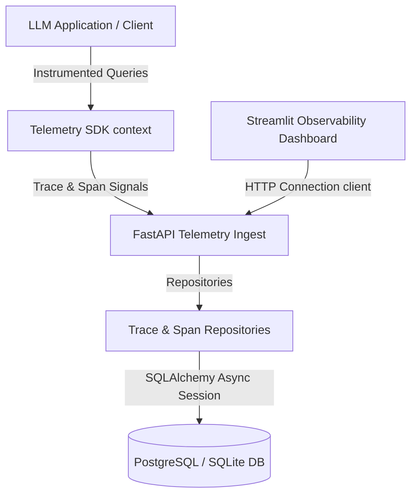
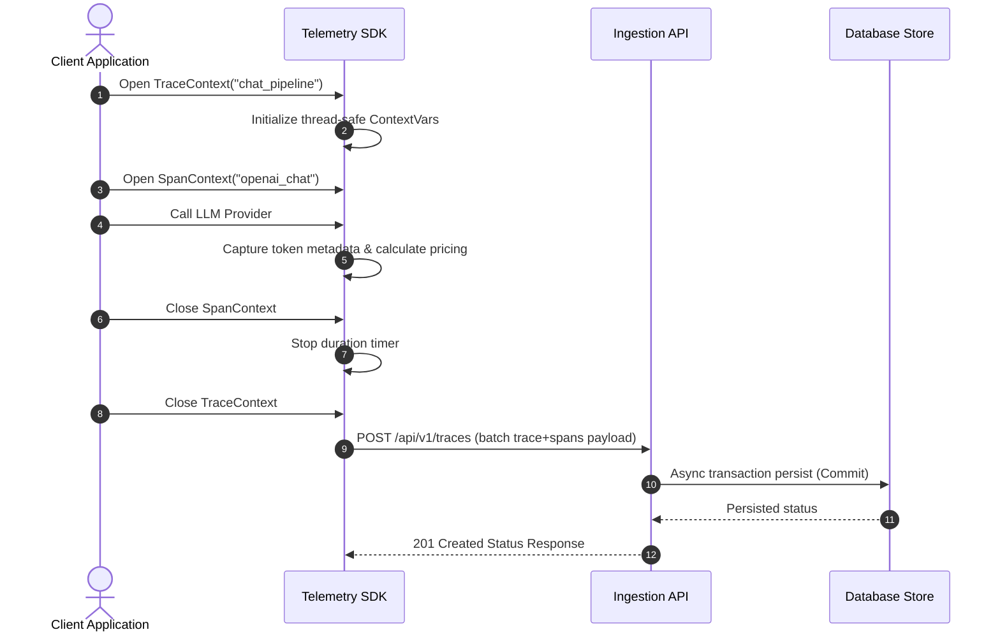
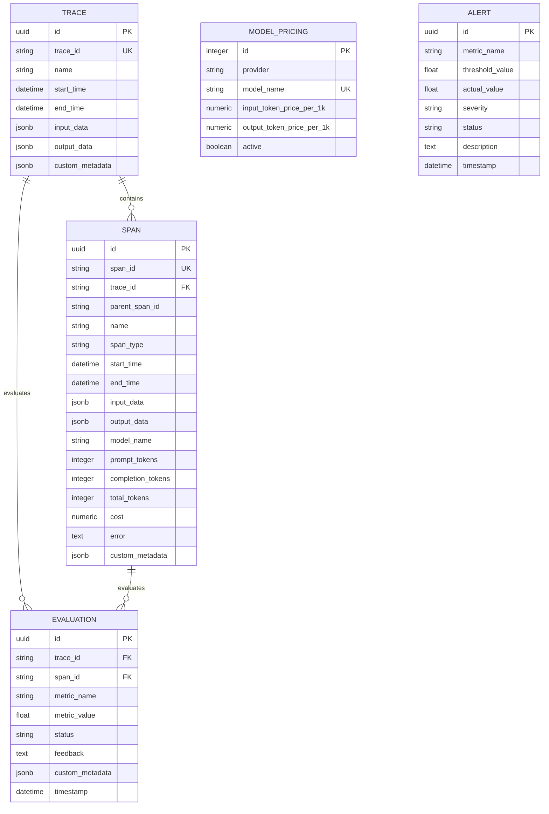

# System Architecture Guide

This document describes the design layers, pipeline flowcharts, database schemas, and modular components of the Enterprise LLM Observability Platform.

---

## Technical Component Flow

---

## Decoupled Architectural Layers

1. **Client / Telemetry SDK**:
   Lightweight, thread-safe Python tracking context managers (`TraceContext` and `SpanContext`) utilizing standard library `contextvars` to isolate trace sessions and prevent crossover risk. Captures exact Monotonic duration offsets and maps execution trees.
   
2. **Ingestion Engine (FastAPI)**:
   High-concurrency async REST controller receiving trace packages, parsing models, validating parameters via Pydantic schemas, and managing database sessions.
   
3. **Persistency Layer (SQLAlchemy 2.0)**:
   Async database connection pooling engine supporting PostgreSQL in production and SQLite in test environments. Repositories manage safe database operations and rollback transactions upon exceptions.
   
4. **Scorers & Evaluators (LLM-in-the-loop)**:
   Decoupled scorer factory registry running hallucination audits, groundedness validation, faithfulness indices, and semantic similarity checks on model generations.
   
5. **Analytics engine**:
   Processes ingested telemetry into timeseries throughput metrics, latency averages, total token costs, and alerts trigger crossings.
   
6. **Observability Dashboard (Streamlit / Plotly)**:
   A dark glassmorphism interface loading live metrics, Gantt timeline sequence charts, evaluation tables, and query testing play pens.

---

## Detailed Data Ingestion Sequence

---

## Database Schema (Entity Relationships)

